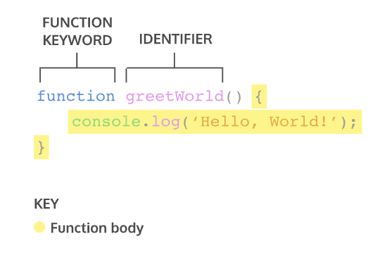

# Operators
## Comparison 
    == equal to
    === equal value and type
    != not equal
    !== not equal in value or not equal in type
    >< greater than, less than
    >= <= greater than or equal to, less than or equal to
  ## Logical
    && and
    || (double pipes) or
    ! not
  ## Ternary
    Example
      variablename = (condition) ? value1:value2
      let coffeeCupLevel = (full) ? "No thanks":"Filler up!";
# Functions
  ## Function Declaration
    
    A function declaration has
      - The function keyword
      - Space, then the identifier followed by ()
      - Function body inside of {}
    
    Does not ask the code to run, only declares existence
  
  ## Call the function
    To call a function
      - Type the name followed by ();
      - This will execute the body of the function
      - Can call functions as many times as needed

# Function Parameters
    **Parameters:** Inputs to functions when a function is declared or defined
      - Used as variables inside the function body
      - When called, will have value of whatever is passed
      - Yes, functions can be defined without parameters
    
    Example
      // In this case, the parameter is name
      function sayHello(name) {
      return `Hello, ${name}!`;
      }

    Example
      // Say thanks to the customer, but add name
      function sayThanks(name) {
      console.log('Thank you for your purchase '+ name + '! We appreciate your business.');
      }

      sayThanks('Cole');

    **Default parameters:** Have predetermined value in case no argument is passed or undefined is called
    
    Example
      function greeting (name = 'stranger') {
      console.log(`Hello, ${name}!`)
      }
 
      greeting('Nick') // Output: Hello, Nick!
      greeting() // Output: Hello, stranger!
    
    Example
      function makeShoppingList(item1 = 'milk', item2 = 'bread', item3 = 'eggs'){
      console.log(`Remember to buy ${item1}`);
      console.log(`Remember to buy ${item2}`);
      console.log(`Remember to buy ${item3}`);
      }
    
    **Return:** Used to pass back information from the function called
    To use
      - Give keyword **return**
      - Give value you want returned
        - Undefined will be returned if no value is given
    
    Example
      function rectangleArea(width, height) {
      if (width < 0 || height < 0) {
        return 'You need positive integers to calculate area!';
      }
      return width * height;
      }
      // If an argument for width or length is less than 0, the prompt will be returned and the second statement will not run.
    
    Example
      function monitorCount(rows, columns) {
      return rows * columns;
      }
      const numOfMonitors = monitorCount(5, 4);
      console.log(numOfMonitors);
      //**Note** the placement of the curly brackets

  ## Functions
    **Functions**: A reusable set of statements to perform a task or calculate a value
      - Can be passed one or more values and return a value at the end of execution
      - Must define somewhere in scope where I wish to call it
    Example
      // This function takes in 2 values and returns the sum of the numbers

      // Defining the function:
      function sum(num1, num2) {
      return num1 + num2;
      }
 
      // Calling the function:
      sum(3, 6); // 9

  ## Anonymous Functions
    **Anonymous Functions:** These functions do not have a name property and can be used to define the keyword or as an arrow function

    Example
    // Named function
    function rocketToMars() {
      return 'BOOM!';
    }
    
    // Anonymous function is not named
    const rocketToMars = function() {
      return 'BOOM!';
    }

  ## Function Declaration
    **Function Declaration:** Used to create named functions and can be called using their declared name
    Built from:
    - Function keyword
    - Function name
    - Optional list of parameters separated by commas and enclosed in ()
    - Function body within {}

    Example
    function add(num1, num2) {
    return num1 + num2;
    }

  ## Helper Functions
    **Helper Functions:** Functions being called within another function to keep code easy to read and debug
    Example
    function multiplyByNineFifths(number) {
      return number * (9/5);
    };
  
    function getFahrenheit(celsius) {
      return multiplyByNineFifths(celsius) + 32;
    };
  
    getFahrenheit(15); // Returns 59
  ## Function expressions
    **Function expression:** Used to define a function inside an expression
      - Function name is usually omitted
      - Called anonymous if no name is given
      - Often stored in a variable in order to refer to it
      - Not hoisted so cannot be called before defined
    **To declare a function expression**
      - Declare variable, probably **const**
      - Give identifier
      - Assign with =
      - () with possible parameters inside
      - {} to contain body
      - ;
    Example
    const plantNeedsWater = function(day){
    if(day === 'Wednesday'){
      return true;
    }
      else{
        return false;
      }
    };

    plantNeedsWater('Tuesday');
    console.log(plantNeedsWater('Tuesday')); //Note double ()

  ## Arrow Functions
    **Arrow function syntax**
      - Introduced in ES6
      - Clean and concise
      - Does not use function keyword but uses ==> (aka fat arrow) to separate parameter from body
      - Do not need () around parameter list
      - Single expression can use concise function body and doesn't need **return** keyword

    Example
      // Arrow function with two arguments 
      const sum = (firstParam, secondParam) => { 
        return firstParam + secondParam; 
      }; 
      console.log(sum(2,5)); // Prints: 7 
      
      // Arrow function with no arguments 
      const printHello = () => { 
        console.log('hello'); 
      }; 
      printHello(); // Prints: hello
      
      // Arrow functions with a single argument 
      const checkWeight = weight => { 
        console.log(`Baggage weight : ${weight} kilograms.`); 
      }; 
      checkWeight(25); // Prints: Baggage weight : 25 kilograms.
      
      
      // Concise arrow functions
      const multiply = (a, b) => a * b; 
      console.log(multiply(2, 30)); // Prints: 60

      //plantNeedsWater Example
      const plantNeedsWater = (day) => {
      if (day === 'Wednesday') {
        return true;
      } else {
        return false;
      }
      };
    
    **Concise arrow functions:** The most condesed form of function is known as concise body
      - If only single parameter no () needed
      - If 0 or multiple parameters, yes () needed
      - Single-line block does not need {}; whatever line evaluates will be automatically returned
    **Implicit return:** 
      - Contents of block immediately follow => and return keyword is removed
    Example
    ----- This -----
    const squareNum = (num) => {
    return num * num;
    };
       ----- -----
    Can be refractored into
    const squareNum = num => num * num;

# Scope
  ## Block scoped variables
    **Block scoped variables:** Only accessible in their blocks or nested blocks, as in const and let
  ## Global variables
    **Global variables:** Accessible throughout a program. Best practice to keep these to a minimum
  ## Scope
    **Scope:** Refers to where values and functions can be accessed
    Examples
      - Global can be used anywhere
      - File module can only be used in the file 
      - Function can be used only inside the function
      - Code block scope can be used only within a code block aka {} 
# Arrays
  ## Arrays
    JavaScript's way of making lists. Can be ordered and include strings, numbers, booleans
    **Array literal:** creates an array with square brackets []
    Yes arrays can be saved to variables.
  ## Access elements in an array
    - Arrays in JS are 0 indexed
    - Can access elements or characters
  ## Update elements in an array
    No const variables cannot be reassigned **but** yes elements within array within const variables are mutatable
    
  ## Length
    .length returns number of items in an array
    Example
      const newYearsResolutions = ['Keep a journal', 'Take a falconry class'];
 
      console.log(newYearsResolutions.length);
      // Output: 2
      - dot notation, aka chaining a period with the property name
  ## Push
    .push() adds items to end of arrays
    - chain with dot notation
    - call it like a function, because it is a function
    Example
      const chores = ['wash dishes', 'do laundry', 'take out trash'];
      chores.push('change laundry' , 'fold clothes');
      console.log(chores);
  ## Pop
    .pop() removes last item of array
    - No does not take arguments
    - Yes can be assigned variable
    Example
      const newItemTracker = ['item 0', 'item 1', 'item 2'];
 
      const removed = newItemTracker.pop();
      
      console.log(newItemTracker); 
      // Output: [ 'item 0', 'item 1' ]
      console.log(removed);
      // Output: item 2

  ## Index of more arrays
    .concat() merges arrays
    .filter() Creates new array with all elements that pass the test from provided function
    .find() Returns the first element in array that satisfies the given function
    .findIndex() Returns first index that passes callback functions' test, -1 if no element passes
    .shift() Removes and returns the first element in an array and shift all the other items in the array down one place
    .unshift() Adds one or more elements to beginning of array and returns new length
    .slice() Returns a shallow copy of all or part of an array without modifying the original
    Example
      array.slice(start, end);
      - If only one argument given, slice will start at argument and include remaining
      - If no value given, slice will be of whole array
      - No does not mutate
    .indexOf() Returns the index of an element, aka its number in an ordered list
  ## Arrays and functions
  ## Nested arrays
    Arrays can store other arrays.
    Example
      const nestedArr = [[1], [2, 3]];
# Loops
  ## For
    Iterator variable in three expressions
      - Initialization starts the loop and can declare variable
      - Stopping condition: If evaluated to true, block will run, if evaluated to false code will stop 
      - Iteration statement updates the iterator variable on each loop 
      Example
        for (let counter = 0; counter < 4; counter++) {
          console.log(counter);
        }
      Will output 
        0
        1
        2
        3
      counter++ means it will add one after iteration 
  ## Loop in reverse
    - Set iterator to highest desired value
    - Set stopping condition to less than desired amount
    - Decrease in intervals after each condition
    Example
      for (let counter = 3; counter >= 0; counter--){
      console.log(counter);
      }
  ## Loop through arrays 
    - for loop should use array's .length property in its condition
    Example
    const animals = ['Grizzly Bear', 'Sloth', 'Sea Lion'];
    for (let i = 0; i < animals.length; i++){
    console.log(animals[i]);
    }
    Will log
    Grizzly Bear
    Sloth
    Sea Lion
    - Iterator is named i, short hand for index 
    - Elements in arrays are easier in for loops
  ## Nested loops
    Example
      const myArray = [6, 19, 20];
      const yourArray = [19, 81, 2];
      for (let i = 0; i < myArray.length; i++) {
        for (let j = 0; j < yourArray.length; j++) {
          if (myArray[i] === yourArray[j]) {
            console.log('Both arrays have the number: ' + yourArray[j]);
          }
        }
      }
      - For each element in the myArray, inner loop will run in entirety, comparing current element from outer array to each element in inner array
      - When match found, prints string to console
  ## While loop
    Example
    // A while loop that prints 1, 2, and 3
    let counterTwo = 1;
    while (counterTwo < 4) {
      console.log(counterTwo);
      counterTwo++;
    }
    - The counterTwo variable decared before making it Global
    - Start loop with while keyword
    - Follow with stopping aka test condition
    - This is evaluated before each round. If true, block runs. If false, loop stops
    - Code block prints counterTwo to console and increments counterTwo
    "Think of eating like a while loop: when you start taking bites, you don’t know the exact number you’ll need to become full. Rather you’ll eat while you’re hungry. In situations when we want a loop to execute an undetermined number of times, while loops are the best choice."
  ## Do..While loop
    Run code at least once and continue until condition is no longer met
    Example
      let countString = '';
      let i = 0;
      
      do {
        countString = countString + i;
        i++;
      } while (i < 5);
      
      console.log(countString);
      **Different from while because do..while will run at least once
  ## Break
    Allows programs to break from the loop from within the loop's block
    Example
      for (let i = 0; i < 99; i++) {
      if (i > 2 ) {
        break;
      }
      console.log('Banana.');
      }
    
      console.log('Orange you glad I broke out the loop!');
  Parameter: A placeholder for the data that gets passed into a function
  Higher-order function: Accepts functions as parameters, returns a function, or both
  Callback functions: Functions that get passed as parameters
  Anonymous functions can be arguments.

# Iterators
  ## Iteration methods
    aka iterators are methods called on arrays to manipulate elements and return values 
    Examples
    .forEach() executes the same code for each element of an array
      - Can use arrow function syntax
      - Can define a function beforehand to be used as the callback function.
    .map() is similar to .forEach but returns a new array
      Example
        const numbers = [1, 2, 3, 4, 5]; 
        const bigNumbers = numbers.map(number => {
          return number * 10;
        });
          - numbers: an array of numbers
          - bigNumbers stores the return value of calling .map on numbers
          - numbers.map iterates each element in the numbers array and passes the element into the callback function
          - return number * 10 is the code we want each element in the array to have executed. Then values will be saved to new array
          - Does not alter, makes a new array
    .filter() returns an array of elements after filtering out certain elements from the original array 
      - If true then added to new array
      Example
        const words = ['chair', 'music', 'pillow', 'brick', 'pen', 'door']; 
        const shortWords = words.filter(word => {
          return word.length < 6;
        });
          - words is an array that contains string elements
          - shortWords declares new variable that will store returned array
          - Callback is arrow function with single paramenter and each element in words array is passed here as argument
          - word.length < 6; is condition in callback function and if any word has fewer than 6 characters it will be added to shortWords array